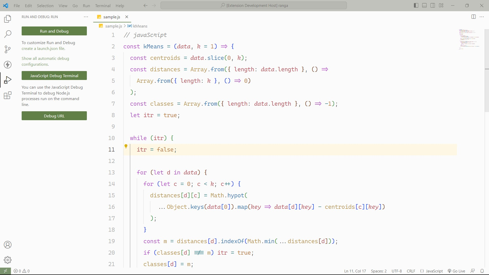

  

<h2 align="center">Olive Light Theme</h2>

  A light theme for Visual Studio Code with an Olive accent color.

## Preview

## License
[MIT License](LICENSE)

## Acknowledgement
This theme drew its inspiration from following projects
- [Github Light Theme by Hyzeta](https://marketplace.visualstudio.com/items?itemName=Hyzeta.vscode-theme-github-light)
- [Theme Studio by Mike](https://themes.vscode.one/)
  
I am grateful to those projects for inspiration and other insights into theme development. Check them out if you have not already.

----------------------------------------
~ [Jeigsaw](https://jeigsaw.github.io)